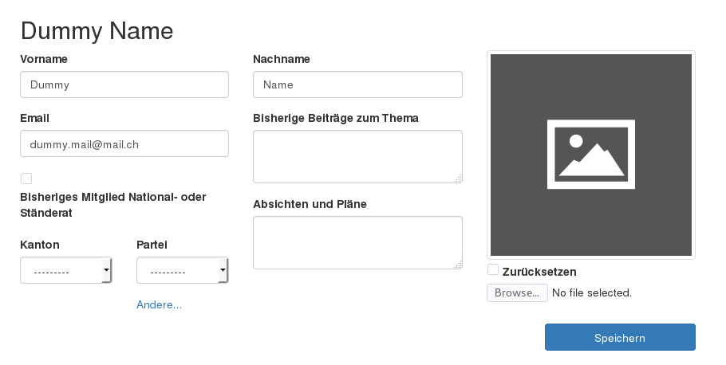
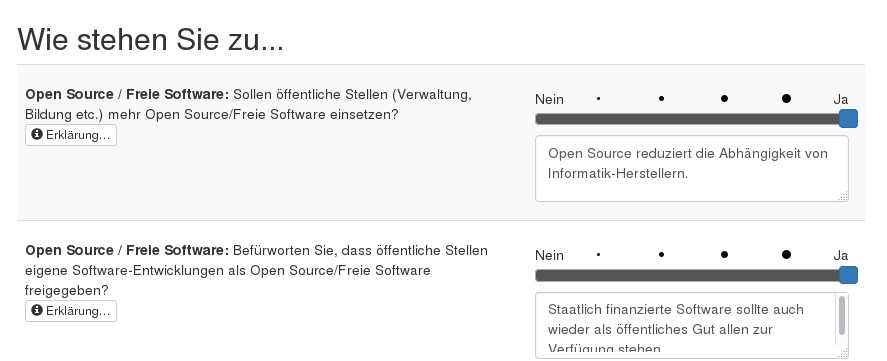
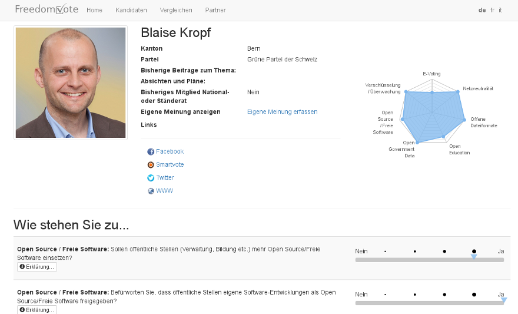
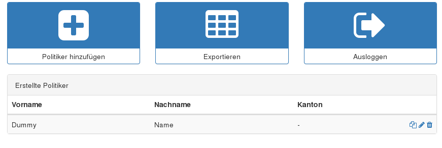
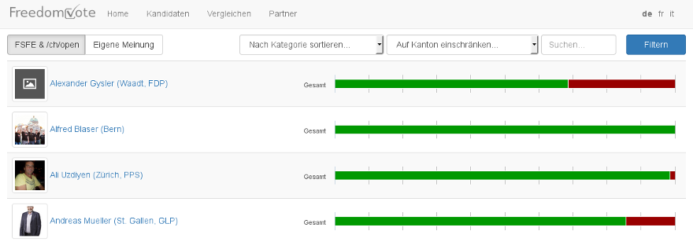
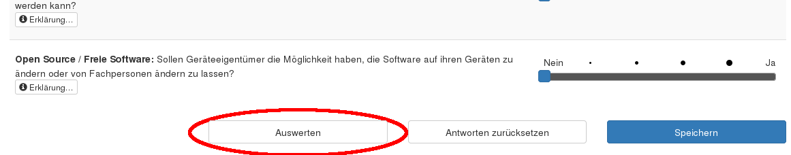

# Freedomvote
A tool to represent the views of politicians on certain topics as a help to the voters.

The following overview explains the key aspects of the software and shows, what one can expect
from the current version.

## As a Politician
* Profile settings

As a politician, you will get a direct link to the personalized profile page.
This link should not be shared with other persons.

**Here the politician can set his personal settings and information.**

* answer the questions

To fill out the questions, one has to navigate to the "questions" page.
This form should look like this:

The questions are answered with "yes" or "no" in various strengths.
Dependent on the answers, the software creates a spider-graph with the results.

If one is not sure about the key terms of the question, one can click on "explanation" to see more details.

After all questions were answered and the profile was saved, the public profile
should look like this:

## As a Party
* Access

Parties will receive a link to the admin area where they can manage the party as well as all the candidates.

* Manage politicians

 * Add politicians
 * Export all politicians to a CSV file

## As a Voter
One can click on "Candidates" and look at the views of the politicians.

If one wants to compare his views with the politicians or see which politicians share his views, one can click on "compare" and fill the exact same questionnaire as the politicians.*

When the questionnaire is filled out one can click on "save", then on "evaluate" and compare the results.

## As an Admin

As an admin, one can manage the following details:
* questions
* cantons
* parties
* politicians

*How to answer the questions is described above
